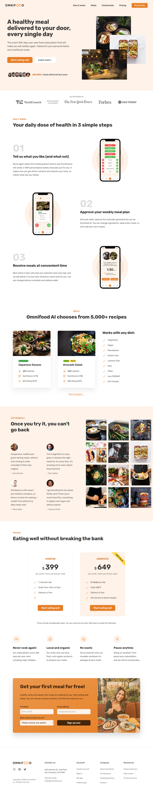

# Omnifood Landing Page 🍽️

A responsive landing page inspired by the Omnifood website.  
Built using **HTML5** and **CSS3**, with a focus on clean structure, responsiveness, and modern UI practices.

⚠️ **Note:** This project is still a work in progress and will be updated regularly.

---

## 🚀 Features

- Fully responsive design (desktop, tablet, mobile)
- Clean and semantic HTML5 structure
- Modern layout using CSS Flexbox and Grid
- Mobile-first responsive approach

---

## 🛠️ Technologies Used

- HTML5
- CSS3

---

## 📸 Preview

---

## 📌 Future Improvements

- Add JavaScript for interactivity
- Improve animations and transitions
- Optimize accessibility (ARIA, contrast, semantics)
- Add dark / light mode support

---

## 📂 Project Status

🟡 Ongoing development

---

## ⚠️ Disclaimer

This project is created **for learning and practice purposes only**.  
The design is inspired by the original Omnifood website.

Original site: https://omnifood.dev/

---

## 📄 License

This project is licensed under the **MIT License**.

---

## 👤 Author

**Apple Mahmud**  
Frontend Developer
